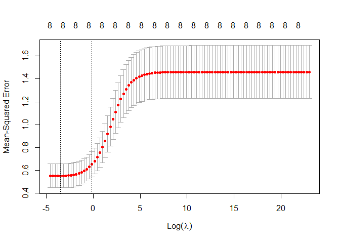
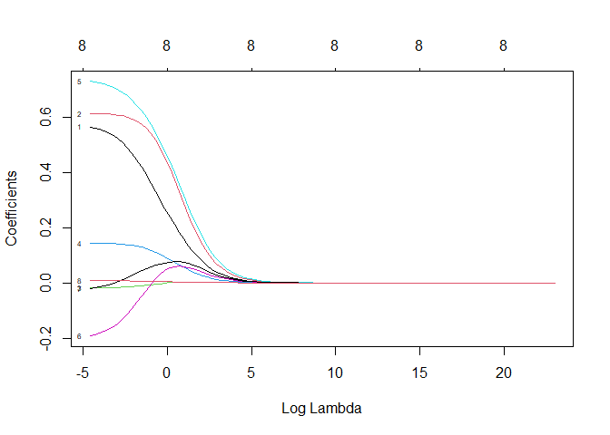

Homework 3
================
Mengzheng Zhang
February 20, 2024

``` r
## load prostate data
prostate <- read.csv("prostate.csv")

train_data <- subset(prostate, train == TRUE)
test_data <- subset(prostate, train == FALSE)

lm_model <- lm(lpsa ~ . -train, data=train_data)

predictions_lm <- predict(lm_model, test_data)
test_error_lm <- mean((predictions_lm - test_data$lpsa)^2)

library(glmnet)

# Prepare matrix of predictors and response vector
x_train <- as.matrix(train_data[, -which(names(train_data) %in% c("lpsa", "train"))])
y_train <- train_data$lpsa
x_test <- as.matrix(test_data[, -which(names(test_data) %in% c("lpsa", "train"))])
y_test <- test_data$lpsa

# Train ridge regression model
grid <- 10^seq(10, -2, length = 100)
ridge_model <- glmnet(x_train, y_train, alpha = 0, lambda = grid)

# Find the optimal lambda using cross-validation
cv_ridge <- cv.glmnet(x_train, y_train, alpha = 0, lambda = grid)
best_lambda <- cv_ridge$lambda.min

# Compute the test error for the model with the best lambda
predictions_ridge <- predict(ridge_model, s = best_lambda, newx = x_test)
test_error_ridge <- mean((predictions_ridge - y_test)^2)

plot(cv_ridge)
```

<!-- -->

``` r
plot(cv_ridge$glmnet.fit, xvar = "lambda", label = TRUE)
```

<!-- -->
